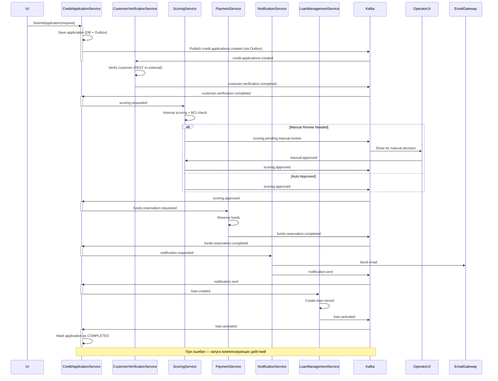

Отлично! Ниже представлен **полный пакет аналитических материалов** для передачи в работу команде разработчиков:
- **Диаграмма последовательности (Sequence Diagram)** — в текстовом описании (так как в тексте нельзя вставить изображение, но ты можешь легко визуализировать это в PlantUML, Mermaid или draw.io).
- **ERD-диаграмма (Entity-Relationship Diagram)** — описание сущностей и связей.
- **Описание микросервисов, их ролей и контрактов.**
- **Контракты событий Kafka.**
- **Рекомендации по реализации.**

---

## 📌 **1. Диаграмма последовательности: Обработка заявки на кредит (SAGA Orchestration)**



> ✅ **Как использовать**: Вставь этот код в [Mermaid Live Editor](https://mermaid.live/edit) или в Notion / Confluence с поддержкой Mermaid.

---

## 📌 **2. ERD (Entity-Relationship Diagram)**

### **Сущности и связи**

#### **1. CreditApplicationService**
```sql
Table credit_applications {
  id: UUID PK
  customer_id: UUID
  amount: DECIMAL
  term_months: INT
  status: ENUM('CREATED', 'VERIFIED', 'SCORING', 'FUNDS_RESERVED', 'NOTIFIED', 'COMPLETED', 'REJECTED')
  created_at: TIMESTAMP
  updated_at: TIMESTAMP
}

Table outbox_events {
  id: UUID PK
  aggregate_type: VARCHAR(50)  -- e.g., "CREDIT_APPLICATION"
  aggregate_id: UUID           -- ссылка на credit_applications.id
  event_type: VARCHAR(100)     -- e.g., "CREDIT_APPLICATION_CREATED"
  payload: JSON
  topic: VARCHAR(100)          -- Kafka topic
  processed_at: TIMESTAMP      -- NULL = не отправлено
  created_at: TIMESTAMP
}
```

#### **2. CustomerVerificationService**
```sql
Table customer_verifications {
  id: UUID PK
  application_id: UUID FK > credit_applications.id
  passport_valid: BOOLEAN
  blacklist_check: ENUM('PASSED', 'FAILED', 'PENDING')
  external_data: JSON
  verified_at: TIMESTAMP
}
```

#### **3. ScoringService**
```sql
Table scoring_results {
  id: UUID PK
  application_id: UUID FK > credit_applications.id
  score: INT
  decision: ENUM('APPROVED', 'REJECTED', 'MANUAL')
  bci_report_id: UUID
  details: JSON
  scored_at: TIMESTAMP
}
```

#### **4. PaymentService**
```sql
Table fund_reservations {
  id: UUID PK
  application_id: UUID FK > credit_applications.id
  amount: DECIMAL
  status: ENUM('RESERVED', 'RELEASED', 'FAILED')
  reserved_at: TIMESTAMP
  released_at: TIMESTAMP
}
```

#### **5. LoanManagementService**
```sql
Table loans {
  id: UUID PK
  application_id: UUID FK > credit_applications.id
  customer_id: UUID
  amount: DECIMAL
  term_months: INT
  interest_rate: DECIMAL
  status: ENUM('ACTIVE', 'CLOSED', 'RESTRUCTURED', 'DEFAULTED')
  start_date: DATE
  end_date: DATE
}

Table repayment_schedule {
  id: UUID PK
  loan_id: UUID FK > loans.id
  payment_number: INT
  due_date: DATE
  amount: DECIMAL
  principal: DECIMAL
  interest: DECIMAL
  status: ENUM('PENDING', 'PAID', 'OVERDUE')
}
```

> 💡 **Замечание**: Все внешние связи (`application_id`, `customer_id`) — **логические**, так как сервисы независимы. Физические связи — только внутри своего bounded context.

---

## 📌 **3. Описание микросервисов и их ответственности**

| Сервис | Ответственность | Входящие события | Исходящие события | Внешние вызовы |
|-------|------------------|------------------|-------------------|----------------|
| **CreditApplicationService** | Управление SAGA, координация шагов, хранение заявки | `credit.applications.created`, `customer.verification.completed`, `scoring.approved`, `funds.reservation.completed`, `notification.sent`, `loan.activated` | `customer.verification.requested`, `scoring.requested`, `funds.reservation.requested`, `notification.requested`, `loan.created` | Нет (кроме Kafka) |
| **CustomerVerificationService** | Проверка клиента: паспорт, ЧС, внешние данные | `credit.applications.created` | `customer.verification.completed`, `customer.verification.failed` | REST: External KYC Service |
| **ScoringService** | Внутренний скоринг + запрос в БКИ | `scoring.requested` | `scoring.approved`, `scoring.rejected`, `scoring.pending.manual.review` | REST: BCI (Бюро кредитных историй) |
| **PaymentService** | Резервация и выдача средств | `funds.reservation.requested` | `funds.reservation.completed`, `funds.reservation.failed`, `funds.reservation.cancelled` | Внутренний платёжный шлюз |
| **NotificationService** | Отправка email-уведомлений | `notification.requested` | `notification.sent`, `notification.failed` | SMTP / Email Gateway |
| **LoanManagementService** | Управление кредитом после выдачи | `loan.created` | `loan.activated`, `loan.repayment.received`, `loan.restructured` | Нет |

---

## 📌 **4. Контракты событий Kafka**

### 📥 **credit.applications.created**
```json
{
  "event_type": "CREDIT_APPLICATION_CREATED",
  "application_id": "uuid",
  "customer_id": "uuid",
  "amount": 500000,
  "term_months": 24,
  "created_at": "2025-04-05T10:00:00Z"
}
```

### 📤 **customer.verification.completed**
```json
{
  "event_type": "CUSTOMER_VERIFICATION_COMPLETED",
  "application_id": "uuid",
  "status": "APPROVED",
  "details": {
    "passport_valid": true,
    "blacklist_check": "PASSED"
  }
}
```

### 📤 **scoring.approved**
```json
{
  "event_type": "SCORING_APPROVED",
  "application_id": "uuid",
  "score": 680,
  "decision": "APPROVED_AUTO"
}
```

### 📤 **funds.reservation.completed**
```json
{
  "event_type": "FUNDS_RESERVATION_COMPLETED",
  "application_id": "uuid",
  "reservation_id": "uuid",
  "amount": 500000
}
```

### 📤 **notification.sent**
```json
{
  "event_type": "NOTIFICATION_SENT",
  "application_id": "uuid",
  "channel": "EMAIL",
  "recipient": "client@example.com"
}
```

### 📤 **loan.created**
```json
{
  "event_type": "LOAN_CREATED",
  "application_id": "uuid",
  "loan_id": "uuid",
  "amount": 500000,
  "interest_rate": 12.5,
  "start_date": "2025-04-06"
}
```

> ✅ Все события — в формате **JSON**, сериализация — **Avro или JSON Schema (рекомендуется Avro + Schema Registry)**.

---

## 📌 **5. Требования к реализации (для разработчиков)**

### 🔧 **1. Transactional Outbox**
- При сохранении `CreditApplication` — в **одной транзакции** записывать событие в `outbox_events`.
- Реализовать **фоновый пуллер** (например, `@Scheduled`), который:
    - Выбирает непроцессированные события (`processed_at IS NULL`).
    - Отправляет в Kafka.
    - Помечает как `processed_at = NOW()`.

> ⚠️ Не использовать Debezium, если нет CDC — лучше ручной пуллер.

### 🔄 **2. SAGA Orchestrator**
- Реализовать как **state machine** или **step-by-step processor**.
- Хранить состояние SAGA в БД или Redis (ключ: `saga:application_id`).
- Состояния: `CREATED → VERIFIED → SCORING → FUNDS_RESERVED → NOTIFIED → COMPLETED`

### 🛡️ **3. Idempotency**
- Каждое событие имеет `event_id` (UUID).
- Перед обработкой — проверять, не было ли уже обработано событие с таким `event_id`.

### 🔄 **4. Retry & Circuit Breaker**
- Для REST-вызовов (например, к BCI) — использовать **Resilience4j**:
    - Retry: 3 попытки
    - Timeout: 5 сек
    - Circuit Breaker: при 5 ошибках — open на 30 сек

### 📊 **5. Мониторинг**
- Метрики:
    - `saga.success.count`
    - `saga.failure.count`
    - `saga.step.duration` (histogram)
- Логи: MDC с `application_id`, `saga_id`

---

## 📌 **6. Дополнительные требования**

| Требование | Описание |
|----------|--------|
| **Согласованность** | Все изменения — через события. Прямые вызовы БД других сервисов — запрещены. |
| **Миграции БД** | Использовать Flyway или Liquibase. |
| **Тестирование** | Интеграционные тесты с Testcontainers (PostgreSQL + Kafka). |
| **Документация** | OpenAPI для REST, контракты Kafka — в Confluent Schema Registry. |
| **Deployment** | Каждый сервис — в отдельном Docker-контейнере, развертывается через Kubernetes. |

---

## ✅ **Передача в разработку**

> **От кого**: Системный аналитик  
> **Кому**: Команда разработки (Java/Kafka)  
> **Дата**: 05.04.2025  
> **Приоритет**: Высокий  
> **Срок реализации**: 3 спринта (6 недель)

### 📎 Вложения:
1. [Sequence Diagram (Mermaid)](https://mermaid.live/edit) — вставить код выше
2. ERD — описание сущностей
3. Контракты Kafka
4. Требования к Outbox и SAGA

---

Если нужно — могу:
- Сгенерировать **OpenAPI-спецификацию** для REST-интерфейсов
- Подготовить **Dockerfile и Helm-чарты**
- Написать **пример реализации OutboxPoller на Spring Boot**
- Создать **Terraform-модуль для Kafka**

Готов к уточнениям!